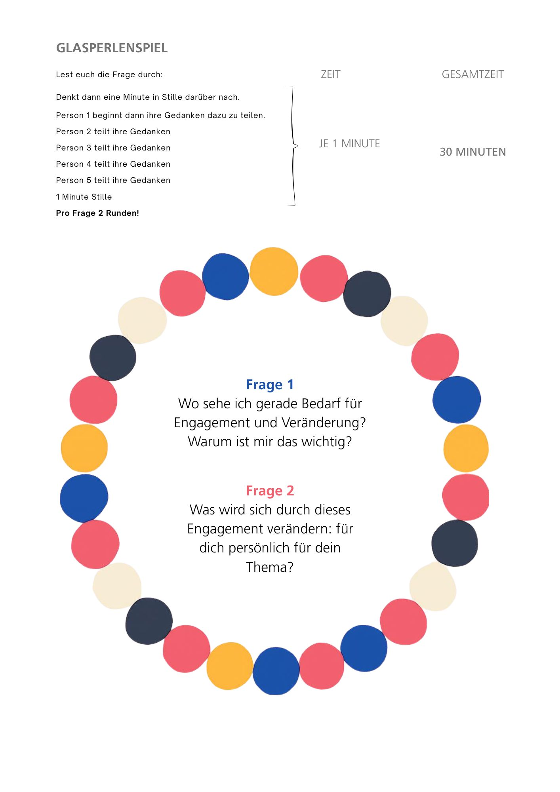

# 1 - Mein „Why“, meine Themen und mein gesellschaftliches Engagement  

Gesellschaftliches Engagement ist vielfältig. Es verbindet. Es ist eine Säule des gesellschaftlichen Miteinander, das OHNE nur sehr viel schwerer bis überhaupt nicht funktionieren würde. Du schenkst einem Thema Zeit, Aufmerksamkeit und dein Know-How. Was du zurückbekommst ist offen und nicht vorhersehbar. Es ist vielseitig und wir wollen dir helfen mit Leichtigkeit einen guten Platz für dich zu finden, der sich gut für dich anfühlt.

Engagement und gesellschaftliche Beteiligung schenkt uns:

### Hoffnung und Resilienz
Dein gesellschaftliches Engagement verbindet dein Leben mit einem Thema, das dir am Herzen liegt. Du bist Teil einer Veränderung. Spürst, dass auch kleine Schritte und kleine Dinge verändern. Es gibt dir Kraft, auch gerade dann wenn gesellschaftliche Entwicklungen sich schwer anfühlen.

### Vernetzung und Stabilität für herausfordernde Situationen
Engagement kann emotional, zeitlich und organisatorisch fordernd sein. Dennoch bekommst du etwas zurück: Menschen die mit dir gemeinsam etwas vorantreiben wollen. Die ähnliche Ziele und Gedanken haben zu einem Thema. Du bist nicht mehr allein, du hast Mitstreiter:innen.

### Wirkung durch gezielten Einsatz deiner Kompetenzen
Wer seine Kompetenzen kennt und weiß, was ins eigene Portfolio passt, findet leichter passende Rollen, Projekte und Wege. Das steigert die Wirkung des Engagements -- und macht es erfüllender. Ein Ziel dieses Lernzirkels wird sein, dass du deine Kompetenzen besser kennenlernst und weißt, wie und wo du sie sinnvoll einsetzen kannst.

### Man müsste, man sollte, man ...
Du kennst es: „Man" sollte dies und jenes ... Engagement unterstützt dich in Diskussionen und Gesprächen mit Menschen, die auf „man" warten. Und wenn du ganz einfach nur über dein Ehrenamt sprichst. Über das eigene Engagement zu sprechen, verändert Gespräche, Sichtweisen und teilweise sogar Verhalten.

### Demokratie und Engagement
Wenn die Demokratie bröckelt, wird sozialer Zusammenhalt wichtiger den je. Was wäre unsere Gesellschaft ohne die sozialen Verbindungen die wir in Vereinen, Initiativen schließen? Wie viel ärmer wäre unsere Gesellschaft, wenn es das Engagement nicht gäbe?

### Neuland
Gesellschaftliches Engagement bedeutet aber auch manchmal: du kommst in eine Gruppe rein, oftmals kennen die Mitglieder sich schon lange und einen Onboarding-Prozess gibt es selten. Das bedeutet für dich: Dinge zu verstehen, die schon lange gewachsen sind. Wenig Zeit für eine persönliche Lernkurve bei den Treffen.

Wenn du selbst eine Initiative gründen willst, ist es ein riesiger Berg an Informationen, die du durchdringen musst. Hierzu geben wir Links und weiterführende Informationen.

Warum bist du hier? Was treibt dich um? Wo spürst du den größten Druck zur Veränderung? Diese Frage wollen wir nun an euch als Gruppe stellen.

### Begrifflichkeiten
Gesellschaftliches Engagement, Engagement, Ehrenamt, Teil einer Initiative sein, eine Gruppe an Menschen die etwas gutes tut, Fürsorge. Gesellschaftliches Engagement ist oft Ehrenamt. Wir wollen hier bewusst nicht über Begriffe einengen und lassen es aus diesem Grund offen, damit der Gestaltungsspielraum sich nicht verengt.

***Persönliche Anmerkung von Johannes:** Engagement bedeutet noch so viel mehr als Ehrenamt! Das wurde mir erst im Austausch und in der Arbeit mit den Autor:innen dieses Lernzirkel-Leitfadens klar. Vorher fühlte ich mich nicht sonderlich engagiert. Mittlerweile weiß ich, wie ich mich auch durch kleine Interventionen immer wieder einbringen kann. Ich bin mir nicht nur bewusster, welche Auswirkungen auch scheinbar nebensächliche Verhaltensweisen von mir haben können, sondern verstehe auch besser, in welchen umfassenderen strukturellen Abhängigkeiten Engagement und Möglichkeiten der Beteiligung stehen.*

## Vertiefende Quellen

- [Broschüre "Gesellschaftlicher Zusammenhalt in Deutschland 2023" der Bertelsmann Stiftung](https://www.bertelsmann-stiftung.de/fileadmin/files/Projekte/Gesellschaftlicher_Zusammenhalt/Gesellschaftlicher_Zusammenhalt_2023/2024_Studie_Gesellschaftlicher-Zusammenhalt-2023.pdf)
- Auf [Oganisiert-euch.de](https://organisiert-euch.de/) gibt es verschiedene Videokurse für bereits Engagierte, z. B. zu Projektmanagement, Moderation, Öffentlichkeits- oder Kampagnenarbeit
- Auch die [Changemaker Academy](https://changemaker-academy.org/) bietet viele verschiedene Kurse an. Besonders empfehlenswert ist das "Changemaker Playbook für Demokratie", das viele Themen adressiert, die auch ihr in den kommenden Wochen bearbeiten werdet.
- Das Buch ["Ein Update für unsere Demokratie"](https://www.oekom.de/buch/ein-update-fuer-unsere-demokratie-9783987261657), herausgegen von Jascha Rohr und als Open Access erhältlich, enthält viele Beiträge von Menschen, die sich politisch für mehr Mitbestimmung, Beteiligung und Transparenz einsetzen.

## Ablauf des wöchentlichen Treffens 1

### Check-In (Zeitmanagement: 2 Minuten pro Person) (10 Minuten)

> Moderation: „Welche Erfahrung oder Beobachtung in Bezug auf Engagement und gesellschaftlicher Beteiligung hat dich zum ersten Mal berührt oder bewegt?"

### Glasperlenspiel (30 Minuten)

Das Glasperlenspiel bringt Gedanken in den Fluss. Jede:r Teilnehmende hat eine Minute Redezeit. Kennst du das? Sprechdenken hilft dir bei der Klarheit und beim Strukturieren der Gedanken. Das Glasperlenspiel trägt seinen Namen, weil es „Gedanken wie Perlen aneinander reiht". Es unterstützt dich dabei. Das Zeitmanagement ist hier besonders wichtig. Haltet euch unbedingt an die Zeiten und auch an die Reihenfolge der sprechenden Personen.

**Hier die Anleitung:**

Lest euch die Frage 1 durch.

Frage 1: **Wo sehe ich gerade Bedarf für Engagement und Veränderung? Warum ist mir das wichtig?**
Denkt eine Minute in Stille darüber nach und teilt dann reihum eure Gedanken:
- Person 1 beginnt, ihre Gedanken dazu zu teilen (1 Minute).
- Person 2 teilt ihre Gedanken (1 Minute).
- Person 3 teilt ihre Gedanken (1 Minute).
- Person 4 teilt ihre Gedanken (1 Minute).
- Person 5 teilt ihre Gedanken (1 Minute).

Nehmt euch eine Minute Stille. 
Startet anschließend eine neue Runde zur gleichen Frage.

Nach zwei Runden zu Frage 1 fahrt ihr nach dem gleichen Prinzip mit Frage 2 fort:

**Frage 2: Was wird sich durch dieses Engagement verändern: für dich persönlich für dein Thema?**

### Dokumentation und Austausch (10 Minuten)

Tauscht euch im Anschluss aus:

Wo seht ihr Übereinstimmungen wo Unterschiede in euren Gedanken?

Sammelt eure Erkenntnisse und haltet sie, wenn ihr möchtet, fest.

### Check-Out (10 Minuten)

Gibt es einen Satz, einen Gedanken, der dich im Nachgang zu eurem Treffen heute beschäftigen oder begleiten wird?

## Vorbereitung Woche 2
Lest euch bitte gemeinsam den Vorbereitungs-Block im nächsten Kapitel 2 "In welchem Bereich möchte ich aktiv werden?" durch. Hier werdet ihr euch nochmal vertiefend mit den Themen beschäftigen.

## Musikalische Inspiration zu Woche 1

**Searching for Sugarman:** Ihr seid auf der Suche. Im Dokumentarfilm „Searching for Sugarman" machen sich zwei Musikfans auf die Suche nach dem Musiker Sixto Rodriguez, der bei den Protestsongs für die „Anti"-Apartheid Bewegung eine große Rolle spielte. Mehr soll nicht verraten werden.

- Zum Trailer der Dokumentation: <https://youtu.be/9yegqEwDsUE?si=euPwaomJDbRL7Tr1>

- Info auf Wikipedia: <https://en.wikipedia.org/wiki/Searching_for_Sugar_Man>

- Sound auf Youtube: <https://www.youtube.com/watch?v=E90_aL870ao>
