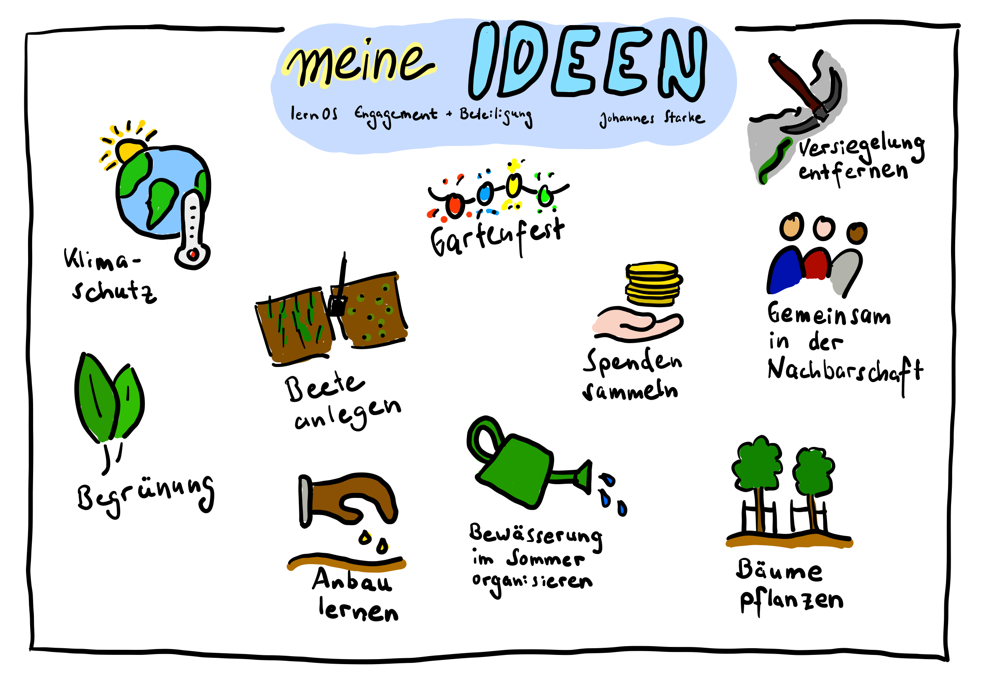

# Woche 2 – In welchem Bereich möchte ich aktiv werden?

Im letzten Kapitel habt ihr euch damit auseinandergesetzt, wieso ihr ganz grundsätzlich aktiv werden möchtet. Außerdem habt ihr bereits begonnen, euch Gedanke über die Themen zu machen, die euch intensiv beschäftigen und denen ihr eventuell euer Engagement widmen könntet. In diesem Kapitel geht es darum, diese Suche weiter zu konkretisieren.

Keine Sorge: Du musst Dir noch nicht sicher sein, was Dein Thema und Deine Art des Engagements sind! Ihr seid alle noch ganz am Anfang eurer gemeinsamen Lernzirkelreise und habt insgesamt mindestens neun Treffen Zeit, um euch gegenseitig in eurer Suche zu unterstützen!  

Vielleicht bist Du unsicher und hast überhaupt keine konkreten oder tausend miteinander konkurrierenden Ideen? 

Vielleicht spürst Du bereits, welches Thema Dir besonders wichtig ist, aber Du weißt nicht, wie Du darin aktiv werden könntest? 

Vielleicht glaubst Du, es gibt bereits so viele sichtbare und erfolgreiche Menschen in Deinem Themenfeld, dass Du sowieso nichts Substanzielles beitragen kannst?

Vielleicht fühlst Du Dich allein und zweifelst, ob Dein Thema überhaupt jemanden außer Dich selbst interessiert?

Du wirst es  ahnen: Ziel dieser Woche ist auch, einige eurer Zweifel ins Wanken zu bringen. Das schafft ihr, indem ihr zur Vorbereitung mit eurer individuellen Recherche beginnt. In der gemeinsamen Session berichtet ihr euch über eure Fundstücke, Ideen und Zweifel … und unterstützt euch gegenseitig mit euren Ideen, eurem Wissen und eurem Netzwerk.

> **Persönliche Anmerkung von Johannes:** Ich habe selbst mehrere Themen, zu denen ich aktiv bin oder werden möchte. Die Art, wie ich mich zu diesen Themen positioniere und mehr oder weniger sichtbar bin, ist sehr unterschiedlich. Außerdem ist mein Engagement stark davon abhängig, in welcher Rolle und in welchem Kontext ich mich gerade befinde. 

## Vorbereitung: 
1. Erstelle eine Liste an Themen, zu denen Du Dich engagieren möchtest. Diese Liste kann ganz unterschiedlich sein: 
	- Wenn Du Dich schon entschieden hast, welches ‚Dein‘ Thema ist, versuche bereits, es möglichst konkret zu beschreiben (z. B. „Ich möchte zu einer offenen, geselligen und verständnisvollen Nachbarschaft beitragen, indem ich ein Nachbarschaftsfest mitorganisiere.“)

	- Wenn Du auf der Suche bist oder Deine Themen noch nicht richtig in Worte fassen bzw. konkretisieren kannst, schreibe möglichst viele Ideen auf und gruppiere sie nach Ähnlichkeiten: Begrünung, Beete anlegen, Versiegelung entfernen, Bäume pflanzen, Gemeinsame Aktivität mit den anderen aus meinem Viertel, nachbarschaftlicher Klimaschutz, Gemeinschaftgarten, Gartenfest, Anbau lernen, Spenden für Bäume organisieren, Bewässerung im Sommer organisieren\

           
	- Es ist auch okay, wenn Du gegen etwas aktiv werden möchtest. Du musst keine „konstruktiven Ideen“ einbringen. Besonders wirksame Initiativen entstehen oft aus dem Antrieb, gegen etwas vorzugehen. Es ist nicht Deine Pflicht, darauf gleich etwas aufzubauen! Du kannst also auch Missstände auflisten, gegen die Du Dich engagieren möchtest.
2. Wenn Du Deine Liste erstellt hast, begib Dich auf die Suche nach Namen, Artikeln, Videos, Büchern, Podcasts oder Webseiten von Personen, die sich bereits zu diesen Themen engagieren. Wähle eine oder mehrere engagierte Personen oder Quellen aus und notiere Dir, wieso Du sie gewählt hast. Was lernst Du von Ihnen für Dein eigenes potenzielles Engagement.
3. Es kann beflügeln oder lähmend sein, sich an großen Vorbildern zu orientieren. Versuche, neben den in Schritt 2 gesammelten Quellen zusätzlich besonders kleine oder unscheinbar wirkende Ausdrücke von Engagement zu finden. Vielleicht kommt Dir z. B. im Bereich Klimaschutz nicht nur Luisa Neubauer in den Sinn, sondern zusätzlich eine kleine Handlung aus dem Alltag, die Du neulich beobachtet hast. Bring auch diese Notiz mit Ihn eure gemeinsame Session.

## Playlist:
Hör Dir diese Songs an, wenn Du möchtest. Vielleicht sind Titel darunter, die mit Deinen Themenfeldern zu tun haben? Findest Du einen Song, der Dich besonders anspricht oder Dir Ideen für Dein Engagement gibt? Oder kommt Dir ein anderes Lied in den Sinn? Teile Deine Wochen-Songs gerne in den Kommentaren oder unter dem Hashtag #lernosEngagement.
- MALONDA - Deutschungsungshoheit https://youtu.be/yp-Q2FRVwcY?si=EkszY-xb5dnpADLN 
- K.I.Z - Frieden https://youtu.be/lnsf4b69JbI?si=kFUVszR_ExE_qEWe 
- KAFVKA - Alle hassen Nazis https://youtu.be/2DXK_Q6mNjM?si=qippUaJj9bmskucz
- LIN, Faravaz, Sookee, Hanie – Jin* Jiyan Azadi https://youtu.be/QHa8bfs2Tjc?si=eyLUkBkqn7NZs80f
- Eko Fresh - Friedrich https://youtu.be/SwlUNfAzKl0?si=f_Mw7F484GsrNYJV
- Ebow - Free. https://youtu.be/L8D62nCUvKA?si=kW8o2KzCt3aIFU7_
- Herr von Grau - Heldenplätze https://youtu.be/VCHjJMXE0UE?si=phu60AyhZv4qPw3P  
- Hannes Wader - Es ist an der Zeit https://youtu.be/nu0PPSiB96o?si=4ONZvC70E7HUcUtf
- Victor Jara - Manifiesto https://youtu.be/uj-3mpjDC8M?si=G4hhXALSAdOiTrM5
- Buffalo Springfield - For What It‘s Worth https://youtu.be/5mKXw5mUizg?si=1ydTal0gNZBeVT90
- Dieter Süverkrüp - Der Baggerführer Willibald https://youtu.be/aKZcNLNIbz0?si=qJi88rXUqNm9OuWI
- Marcus Wiebusch - Der Tag wird kommen https://youtu.be/-qOg8E4Tzto?si=UHWmEfFQBb9VIu33
- Heaven Shall Burn - Voice of the Voiceless https://youtu.be/v9By2REDRVQ?si=j_tmvaFjvxHgxlC
- Apsilon - Keiner von euch https://youtu.be/nIRlxK8vcgA?si=Vp9rqQ0fgXp6tVDb  

## Treffen Woche 2
### Check-In (ca. 10 Minuten, also 2 Minuten pro Mitglied)
- Was brauchst Du heute?
- Welcher Song aus der Playlist trägt Dich durch die Woche? Wie und wieso?
- Zu was hast Du Dich in der vergangenen Woche engagiert … und wirke es noch so klein?
- Welcher Gedanke ist Dir aus dem letzten Weekly präsent?

### Vorstellung eurer Vorbereitungen (ca. 30 Minuten, also 6 Minuten pro Mitglied)
- Stellt euch gegenseitig eure Listen vor und teilt Hinweise, Ergänzungen und Empfehlungen.
- Nehmt euch pro Vorstellung bewusst ein paar Minuten Zeit, ergänzende Quellen oder Empfehlungen aus dem eigenen Netzwerk zu finden und mit der vorstellenden Person zu teilen.
- Macht euch zu den Vorstellungen und Hinweisen Notizen, um im nächsten Schritt auf sie zurückgreifen zu können.

### Ergänzung oder Konkretisierung eurer Themen (ca. 15 Minuten, also 3 Minuten pro Mitglied):
- Was habt ihr aus von den Vorstellungen und Hinweisen eurer Mitzirkelnden gelernt? Nehmt euch jeweils eine Minute zum Nachdenken. Ergänzt, schärft oder konkretisiert eure Themensammlung und teilt eure Überarbeitung miteinander.

### Check-Out (ca. 5 Minuten, also 1 Minute pro Mitglied)
- Was nimmst Du mit – in einem Satz?

## Nachbereitung
Wenn Du etwas Zeit findest, konkretisiere Deine Liste gerne bereits weiter. Starte mit der Suche z. B. nach ….
- Historische Vorbilder (Einzelpersonen oder Organisationen)
- Internationalen Organisationen zu Deinem Thema
- Organisationen in dem Land, in dem Du wohnst
- Organisationen nahe Deinem Wohnort
- Organisationen, die sich online organisieren
- Initiativen in Deiner Stadt / Kommune
- Erwähnungen in der lokalen Presse

Du musst hier noch nicht zu konkret werden. In Kapitel 6 widmest Du dich dieser Suche noch einmal intensiv. 

Vergiss außerdem nicht, Dich auf Woche 3 vorzubereiten.