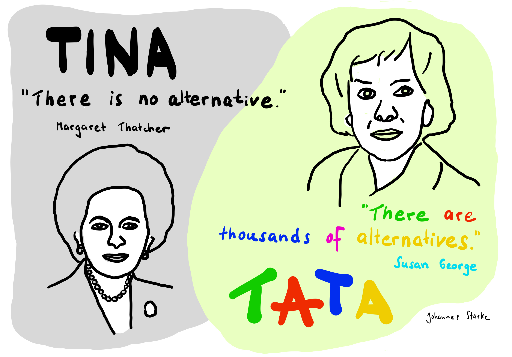
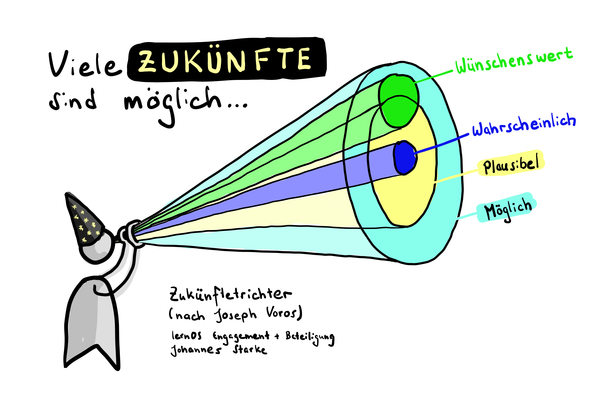

# 3 – Zukünfte meines Engagements  
In den letzten Wochen hast Du Dir bereits viele Gedanken darüber gemacht, in welchem Themenfeld Du Dich engagieren möchtest. Du hast recherchiert, wie sich andere engagieren und Dich mit Deine Mitzirkelnden ausgetauscht.  Wahrscheinlich hast Du Dir auch schon überlegt, was Du mit Deinem Handeln bewirken könntest und Dir vorgestellt, wie einen Welt aussehen könnte, in der Engagement von Dir und anderen etwas zum Besseren bewirkt.  

In dieser Wochen wirst Du konkreter. Du wirst Deine Vorstellung wahrscheinlicher und wünschenswerter Zukünfte erkunden und dafür Deine „Zukünftebildung“ (der englische Begriff lautet „Futures Literacy“) mobilisieren.  

Zukünftebildung ist unsere Fähigkeit, die Unbekanntheit und Offenheit von Zukunft in unseren Zugang zur Welt einzubinden und nutzbar zu machen. Grundlage unserer Zukünftebildung ist die Erkenntnis, dass es nicht die eine Zukunft gibt, sondern vielfältige mögliche Zukünfte. Wir können die Zukunft nicht planen. Was wir aber tun können: Uns gewahr werden, welche Zukunft wir für wahrscheinlich halten und welche alternativen Zukünfte wir uns wünschen. Wir können uns darüber austauschen, welche verinnerlichten Annahmen hinter unseren Vorstellungen stehen. Und wir können miteinander erarbeiten, welches Handeln uns unseren wünschenswerten Zukünften näherbringen könnte. Durch Zukünftebildung lösen wir uns aus der Lähmung der Alternativlosigkeit, eröffnen einen neuen Raum voller emanzipatorischem Potenzial und erlauben uns, die Frage zu stellen: Was wäre, wenn ...? Was wäre möglich?  
In dieser Woche wagst Du erste Schritte in Deine wahrscheinlichen und in Deine wünschenswerten Zukünfte.   
 

## Vorbereitung   
Wenn Du an Zukünfte des Themas denkst, in dem Du Dich engagieren möchtest ... welche davon hältst Du für sehr wahrscheinlich, dass sie eintreten ... ganz egal, wie Du dazu stehst? So wahrscheinlich, dass Du darauf wetten würdest, dass die Entwicklung so sein wird? Sammle und beschreibe diese wahrscheinliche Zukünfte. Vielleicht findest Du Belege oder Hinweise, die Dich in Deiner Annahme unterstützen? (Statistiken, Zeitungsartikel, Studien, Zitate, Produkte ...)?  

Erstelle eine Zusammenstellung Deiner Vorstellung zu wahrscheinlichen Zukünften und ggf. Deiner Fundstücke dazu, um sie Deinen Mitzirkelnden vorzustellen.  

*(In der Vorbereitung geht es nur um wahrscheinliche Zukünfte, nicht um wünschenswerte Zukünfte! Es kann also sein, dass Deine Vorbereitung eher düster ist und Dir keine sonderlich gute Laune bereitet. Lass Dich davon nicht demotivieren. Im gemeinsamen Weekly und danach wirst Du dann Deine wünschenswerten Zukünfte erkunden. Das wird Dich für den vielleicht hoffnungslosen Start in die Zukünfte entschädigen und Dir Lust auf alternative Zukünfte bereiten.)*   

## Vertiefende Quellen zu Zukünftebildung (optional):  
- Der Neue Narrative Artikel *„Zukunftsangst überwinden mit Futures Literacy“* (von Charleen Rethmeyer)  fasst übersichtlich und praxisnah zusammen, wie uns Zukünftebildung als Set von sechs Teilkompetenzen und Werkzeug Fragen offener Zukünfte im Hier und Jetzt bearbeiten lässt: [https://www.neuenarrative.de/magazin/zukunftsangst-ueberwinden-mit-futures-literacy](https://www.neuenarrative.de/magazin/zukunftsangst-ueberwinden-mit-futures-literacy "https://www.neuenarrative.de/magazin/zukunftsangst-ueberwinden-mit-futures-literacy")   
- „FUTURA – Die gute Amöbe“ ist eine Sammlung wünschenswerter Zukünfte vieler verschiedener Themenfelder. Vielleicht findest Du hier poetische Inspiration auch zu Deinem eigenen Thema. Das kostenfreie PDF gibt es gegen Preisgabe Deiner E-Mail-Adresse:[https://futura-yeah.at](https://futura-yeah.at/ "https://futura-yeah.at/") 
- Die Webseite [https://zukuenfte.net](https://zukuenfte.net/ "https://zukuenfte.net/")  des Zentrum für gesellschaftlichen Fortschritt e.V. ist ein guter Einstieg in theoretischere Aspekte und Aktivitäten des Zukünfte-Netzwerks. Melde Dich für den Newsletter an, um regelmäßig Informationen zu Netzwerk-Aktivitäten zu erhalten.  
- Wenn Du tiefer eintauchen möchtest, was Zukünftebildung ist und wie sie in Zukünftelaboren eingeübt wird, höre Dir den „*LERNLUST-Podcast #31 Eine Zukunft ist nicht genug: Vom Lernen in und über Zukünfte*“ mit Dr. Stefan Bergheim, Claudia Schütze und Johannes Starke (Autor dieser Lernzirkel-Wochenbeschreibung) an: [https://lernlust-podcast.podigee.io/42-eine-zukunft-ist-nicht-genug](https://lernlust-podcast.podigee.io/42-eine-zukunft-ist-nicht-genug "https://lernlust-podcast.podigee.io/42-eine-zukunft-ist-nicht-genug") (1:14 Std.)   
- Der Futures Literacy Navigator ist eine wachselnde Sammlung von Ressourcen zu Futures Literacy:[ https://flnavigator.net/materials](https://flnavigator.net/materials "https://flnavigator.net/materials") 

## Playlist: 
Hör Dir diese Songs an, wenn Du möchtest. Sie stimmen Dich auf die Übung im Weekly ein und holen Dich vielleicht etwas aus der trüben Stimmung, die Dich nach dem Erfassen der wahrscheinlichen Zukünfte erwischt hat? Findest Du einen Song, der Dich anspricht und Mut auf alternative Zukünfte macht? Oder kommt Dir ein anderes Lied in den Sinn? Teile Deine Wochen-Songs gerne in den Kommentaren oder unter dem Hashtag #lernOSEngagement 

- [John Lennon - Imagine](https://youtu.be/Ts0XSyWpMnU?si=LjOQsWvVlwLTuwdm)
- [Disarstar x Jugglerz - Wovon sollen wir träumen(feat. Frida Gold)](https://youtu.be/v9HATCwOpsc?si=2IaAWEkyjSzGNqMz)
- [Peter Fox (feat. Inéz) - Zukunft Pink](https://youtu.be/kNT87WiK1dg?si=hj_1hcJdASUkUXUr)
- [Soffie - Für immer Frühling](https://youtu.be/M-klKqj-7Lo?si=BXW0IT8olyuGkTTz)
- [Louis Armstrong - What A Wonderful World](https://youtu.be/CaCSuzR4DwM?si=k2Qyv0K8B1uxkld-)
- [Ton Steine Scherben - Schritt für Schritt ins Paradies](https://youtu.be/BtdAoB_hP6g?si=QUPyZGUPgbFBnjBU)
- [$OHO BANI, Herbert Grönemeyer - Zeit, dass sich was dreht](https://youtu.be/GwTveAHmDp8?si=Ey6AHPqiWsjPDMmd)
- [Shervin Hajipour - Baraye](https://youtu.be/z8xXiqyfBg0?si=c96u1Zdr4TRmkWYz)
- [Fog - Bunte Welt](https://youtu.be/LFyFl5BxfdM?si=sQx5FJ2yPOn7jiM6)
- [KUMMER (feat Nina Chuba)- Alles wird gut](https://youtu.be/9Mk9hKEVfpw?t=1455&si=KvT5PsFqiZ2QiB2o)

## Treffen Woche 3  
### Check-In (ca. 10 Minuten, also 2 Minuten pro Mitglied)  
  - Was brauchst Du heute?  
  - Welcher Song aus der Playlist trägt Dich durch die Woche? Wie und wieso?  
  - Zu was hast Du Dich in der vergangenen Woche engagiert … und wirke es noch so klein?  
  - Welcher Gedanke ist Dir aus dem letzten Weekly präsent?  
### Vorstellung eurer wahrscheinlichen Zukünfte (ca. 15 Minuten, also 3 Minuten pro Mitglied)  
  - Präsentiert euch eure Vorstellungen wahrscheinlicher Zukünfte und der begleitenden Belege oder Hinweise.   
  - Befragt euch bei den Vorstellungen gegenseitig: Worauf gründen sich Deine Vorstellungen? Was stützt Deine Annahme?  
  - Versucht, die Vorstellungen nicht zu bewerten oder zu korrigieren. Es geht in der Übung nicht darum, euren Mitzirkelnden Mut zu machen, ihnen ihre Annahmen auszureden oder zu demonstrieren, dass alles nicht so schlimm ist.  
### Gedankenreise in eine wünschenswerte Zukunft eures Themas (ca. 30 Minuten insgesamt)  
  - Ihr begebt euch jetzt auf eine Gedankenreise. Ihr habt die Wahl, wie ihr vorgehen mögt:   
    - Entweder liest die moderierende Person den untenstehenden Text zur Gedankenreise vor. Alle anderen konzentrieren sich auf die Lesung und lassen ihre wünschenswerten Zukünfte vor ihrem inneren Auge entstehen. Begebt euch dazu in einem bequeme Position und schließt vielleicht die Augen. Wenn die moderierende Person den Text fertig gelesen hat, kehren alle ins Hier und Jetzt zurück.  
    - Damit die moderierende Person von der Gedankenreise nicht ausgeschlossen ist, könnt ihr alternativ auch das [Audiodokument](https://www.johannes-starke.de/lernosengagement/src/Gedankenreise.mp3) aufrufen und euch die Instruktion zur Gedankenreise vorlesen lassen.  
- Nach Beendigung der Gedankenreise macht ihr euch Notizen zu den von euch imaginierten wünschenswerten Zukünften.   
- Stellt euch eure wünschenswerten Zukünfte gegenseitig vor.  
### Check-Out (ca. 5 Minuten, also 1 Minute pro Mitglied)  
  - Was nimmst Du mit – in einem Satz?  
   
## Gedankenreise   
*(langsam und ruhig vorgelesen von der moderierenden Person … oder alternativ abgespielt in diesem [Audiodokument](https://www.johannes-starke.de/lernosengagement/src/Gedankenreise.mp3).)*  

Wo auch immer Du gerade bist: Mach es Dir bequem.  
Du kannst sitzen … stehen … liegen … so, wie es sich für Dich gut anfühlt.  

Bist Du mit Deinen Mitlernenden online verbunden? Dann möchtest Du vielleicht die Kamera ausschalten, um einen Moment ganz bei Dir zu sein.  

Wenn Du möchtest, schließe Deine Augen.  

Atme ein … und aus. Langsam. Tief. Ruhig.  

Ich lade Dich jetzt ein, eine Reise in Gedanken zu unternehmen.   
Weit nach vorne … in eine Zukunft im Jahr 2040.  
Ein Sprung durch die Zeit.   

Zeit, die genutzt wurde. Zeit, in der etwas bewirkt wurde. Von Dir, von vielen vielen anderen Menschen, von Institutionen, von unserer Gesellschaft.  

Im Jahr 2040 sind Deine Wünsche an eine gute Zukunft Wirklichkeit geworden.  

Wie sieht diese Zukunft aus? Wie fühlt sie sich an? Welche Rolle spielst Du darin?   

Geh auf eine Entdeckungsreise. In Gedanken trittst Du jetzt ein in diese richtig gute Zukunft im Jahr 2040.  

Du fühlst Dich frisch und voller Energie. Du bist neugierig. Du bewegst Dich langsam einen Weg entlang und nimmst wahr, was um Dich herum geschieht.  
All das, wofür Du Dich eingesetzt hast, ist Wirklichkeit geworden. All Deine Wünsche und Träume. Sie sind – jetzt – Realität.  

Das fühlt sich gut an, oder? 
Dein Engagement hat gewirkt. 
Hat etwas bewirkt.  

Lass das, was Du um Dich herum wahrnimmst, auf Dich wirken.  

Was siehst Du? Was hörst Du? Was riechst Du und was schmeckst Du?  

Richte Deine Aufmerksamkeit auf einige Mitmenschen um Dich herum. Wer ist da? Was tun diese Personen? Wie sind sie? Wie interagieren sie?  

Wie ist die Umwelt?   

Auf welche Angebote stößt Du?  

Welche Organisationen begegnen Dir? Was tun sie? Wie arbeiten sie?  

Bewege Dich weiter. Du entdeckst noch mehr. Viel viel mehr.   

Was fällt Dir auf?  
Was gefällt Dir?  
Was erstaunt Dich?  
Was erfreut Dich … auch wenn Du es vielleicht noch nicht verstehst oder nicht weißt, wie es entstanden ist? Denn …. alles ist möglich geworden!  

Stell Dir vor, Du hast ein Aufzeichnungsgerät dabei. Vielleicht eine Kamera, ein Diktiergerät, ein Notizbuch oder eine Tasche.  
Sammle einige Eindrücke und Fundstücke. Nimm sie mit … hinüber in das alte Jahr, in das Du gleich zurückwechselst. Nimm sie mit.  

Nimm noch etwas mit. Es ist genug da. Es ist so viel da.  

Was nimmst Du mit?  

Achte noch ein letztes Mal auf Deine wünschenswerte Zukunft im Jahr 2040.   

Du nimmst jetzt Abschied. Für den Moment. Nur für den Moment. Denn das Jahr 2040 wird kommen. Mit Dir. Und Deinem Engagement dafür.   

Atme noch einmal tief durch.  

Öffne langsam Deine Augen.  

Herzlich willkommen zurück!  

## Nachbereitung  
Arbeite die Beschreibung Deiner wünschenswerten Zukunft weiter aus. Erstelle einen Bericht aus ihr (z. B. einen Reisebericht oder Zeitungsartikel ...). Wenn Du möchtest, kannst Du sie visualisieren. Beschreibe sie so anschaulich, dass die Sehnsucht nach ihr auf andere überspringen kann ... .  
Bonusaufgaben: Stelle Deine wünschenswerte Zukunft einer vertrauten Person in Deinem Umfeld vor oder poste sie sogar in einem sozialen Netzwerk. (Wenn Du magst, markiere Deinen Beitrag mit *#lernOSEngagement* und mache die Autor:innen dieses Leitfadens darauf aufmerksam). Welche Reaktionen erhältst Du?   
