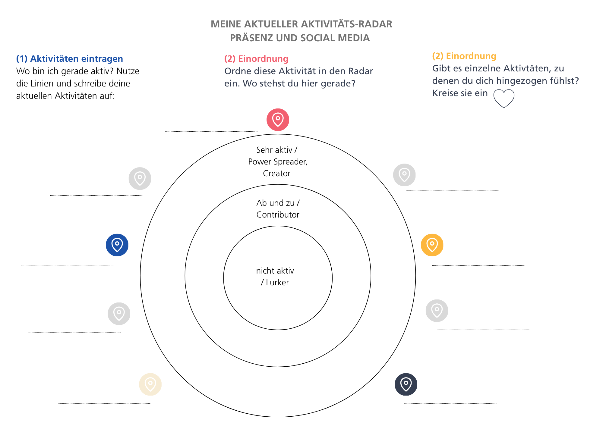

# 4 – Darüber sprechen 
## Vorbereitung
Hast du Zeit gefunden deine wünschenswerte Zukünfte festzuhalten? Ist es dir leicht gefallen es mit einer anderen Person zu teilen? Hast du darüber geschrieben? Wir wollen heute darüber reflektieren, wie du Informationen und Themen die dich und dein Thema betreffen konsumierst, teilst und verbreitest. Welcher Umfang und wie tief du das bereits machst, ist hier ergebnisoffen. 

Engagement braucht Sichtbarkeit. Engagement braucht Aufmerksamkeit. Vernetzte Aufmerksamkeit. Wer still und leise und ohne Vernetzung aktiv wird, kann in Krisenmomenten niemanden mobilisieren oder fragen. Engagement lebt von vielfältigen Denkweisen und Inspirationen. Zwischen kompletter Unsichtbarkeit und voller Präsenz gibt es einen Raum. Wie weit willst du gehen und wo stehst du aktuell? Wie vernetzt bist du? Wo bist du vielleicht bereits aktiv? Heute wollen wir einen Blick auf Kommunikations- und Aktivitäts-Logiken werfen und dir eine Reflexionsfläche dafür bieten. 

**Online** unterscheidet man bspw. bei **Social Media Aktivitäten** zwischen. 4 Typen: Der **Lurker**, schleicht herum und schaut nur zu, was andere posten und schreiben oder kommentieren. Der **Contributor** unterstützt Posts durch „Likes“ oder gibt niedrigschwellige Kommentare, bzw. teilt Postings in der eigenen Timeline. Der **Creator** schreibt, kuratiert und kommentiert Posts. **Power Spreader** sorgen dafür, dass deine Posts oder Inhalte Reichweite erhalten. Wir alle befinden uns hier vermutlich in einer Zwischenwelt. Die Grenzen zwischen Lurker, Contributor, Creator und Power Spreader verschwimmen. Wie du dich vernetzt und wie vielfältig dein Netzwerk ist, ist ein weiteres Thema. Wen möchtest du erreichen? Was sind deine Ziele? Wie viel musst du investieren?

In **Präsenz** wiederum gelten andere und zusätzliche Qualitäten: Gruppendynamiken müssen verstanden werden, Dialoge und Vernetzungstreffen organisiert und moderiert werden. Es gibt viele Initiativen, die sich in Präsenz vor Ort in einem sogenannten Plenum treffen. Auch hier sind die unterschiedlichsten Menschen in Gruppen zusammen: die besten Aktivist:innen sind nicht unbedingt die besten Moderator:innen oder Strateg:innen. Hier einen Blick auf die eigene Ressource im Sinne von „wo kann ich am meisten Wirksamkeit entwickeln“ ist unbedingt wichtig. So schöpfst du das aus deinem Ehrenamt, dass dich motiviert: Wirksamkeit, die Unterstützung anderer und nicht zuletzt Spaß am Tun. 

Heute wollen wir herausfinden, wo du bereits aktiv bist oder bereits drin bist. Beispiel: bist du bereits Mitglied in einer Partei? Einem Verein der ein Vorhaben unterstützt das dich umtreibt? Bist du auf einer Social Media Plattform und folgst dort Aktivist:innen? Bist du selbst bereits aktiv? 

Die Übung heute soll euch einen Raum bieten darüber nachzudenken, wo bereits etwas da ist und wo eventuell etwas aufgebaut werden kann. 
Dazu passen hier die Geschichte von Katharina: 

> **Persönliche Erfahrung von Katharina:** Ich bin ursprünglich in eine Partei eingetreten mit dem Gedanken, eher stilles Mitglied zu sein und um sie finanziell zu unterstützen. Heute engagiere ich mich regelmäßig, aber ganz anders, als ich es mir vorgestellt hatte. Mir wurde klar: Ehrenamt in einer Partei bedeutet nicht nur Infostände, Haustürwahlkampf oder Flyer erstellen. Oft gibt es im Hintergrund Themen, die genauso wichtig sind, zum Beispiel Menschen willkommen zu heißen, Zusammenarbeit zu organisieren oder neue Formen der Beteiligung zu schaffen. Gerade dort konnte ich meine eigenen Stärken einbringen und habe erlebt, wie erfüllend das sein kann. So arbeite ich in einer Arbeitsgruppe mit, die neue Mitglieder willkommen heißt und moderiere Sitzungen. Beide Fähigkeiten bringe ich aus meiner beruflichen Erfahrung mit und bereiten mir große Freude. Wenn du etwas bewegen möchtest, musst du nicht in eine vorgefertigte Rolle passen. Oft entsteht der größte Beitrag genau dort, wo du deine eigenen Fähigkeiten und Vorlieben einbringst. 

## Treffen Woche 4

### Check-In (Zeitmanagement: 3 Minuten pro Person) (12 Minuten)
Hast du an deinem persönlichen Bericht gearbeitet? Was möchtest du hier mit den anderen teilen? Gab es einen besonderen Moment? Ein Aha Effekt? Falls du nichts dazu geschrieben hast, spiegel deinen Mitlernenden was du darüber gedacht hast (zur Erinnerung, die Aufgabe war, bis heute eine Beschreibung deiner wünschenswerten Zukünfte zu erstellen)

### Kommunikation, Vernetzung und Sichtbarkeit: Orientierung (20 Minuten)

#### Aktivitäts-Radar
Erstelle eine Aufstellung deiner Social Media Kanäle und deiner Aktivitäten, die du sonst machst. Es folgen gleich ein paar Beispiele. Besuchst du irgendwelche Gruppen bereits regelmäßig? Nimmst du an Veranstaltungen teil? Bist du bereits Mitglied in einem Verein, einer Partei? Welche nutzt du aktiv? Wofür nutzt du diese? Wie oft nutzt du sie? Wie stark interagierst du? 

#### Beispiel online:

Facebook 
- *aktiv in einer Gruppe*

- *eine Gruppe organisieren*

- *... ansonsten nur lesen*

Instagram

- *Eigener Fotokanal, Austausch mit anderen zu Thema xy*

Mastodon

- *Privater Account, folge ein paar Hashtags, sonst eher inaktiv*

…

#### Beispiele in Präsenz:

Regelmässiger oder wiederkehrende Besuche von

- Gemeinderatssitzungen, politische Veranstaltungen

- Initiativen in Schulen, Elternsprecher:in, Fördervereine, etc.

- Interessensgruppe, Verein, Selbsthilfegruppe, ...

- Veranstaltungen politisch (re:publica, …)

- Critical Mass, … 

...

#### Ordne deine Aktivitäten ein (Online)
**Hier bist du inaktiv und als „Lurker“ unterwegs** 

- Beobachten

- Konsumieren 

**Hier bist du als „Contributor“ aktiv**

-Reagieren

-Feedback geben

-Informationen Teilen / Weitergeben… 

**Hier bist du als „Creator“ und/oder als „Power Spreader“ unterwegs**

-Initiieren / führen 

-Mitgestalten / eigene Inhalte einbringen

-Vernetzen / Beziehungen pflegen

-Diskutieren / Dialog führen 

#### Ordne deine Präferenzen ein (Präsenz)

**Moderation**

- Gruppen moderieren

- Entscheidungen herbeiführen 

- Rahmen der Veranstaltung gestalten

**Organisation**

- Treffen organisieren 

- Veranstaltungsorte finden

- Einladungen, Teilnehmer:innen checkliste, etc.

**Kommunikation** 

- Protokolle erstellen

- Informationen verteilen

- Kontaktlisten erstellen und pflegen 

- ….

**Besuche von Veranstaltungen**

- Wie hoch ist deine Bereitschaft, zu Veranstaltungen gehen (finden meistens Abends statt)?

- Wie sind deine zeitlichen Ressourcen für Veranstaltungen?

### Stellt euch gegenseitig euren Aktivitäts-Radar vor unter den Fragestellungen (15 Minuten)
- Wo stehe ich hier gerade?
- Wie wohl fühle ich mich bei meinen Aktivitäten? 
- Was ist ein sinnvoller nächster Schritt für mich?

### Check out (10 Minuten)
- Welche Erkenntnisse nimmst du heute für dich mit? 

## Vorbereitung für das nächste Mal:
In der nächsten Runde beschäftigt ihr euch mit euren Ressourcen. Bitte macht euch Gedanken, was ihr mit dem Wort Ressourcen verbindet. An was denkt ihr bei Ressourcen? Was glaubt ihr, sind eure persönlichen Ressourcen? 

## Vertiefende Quellen (optional):
- [Blogartikel von Tanja Laub zu Verhalten auf Social Media Kanälen](https://communitymanagement.de/9091-prinzip-widerlegt-worauf-sie-stattdessen-fuer-die-einschaetzung-der-community-aktivitaeten-achten-sollten/)
- [Lernpfad zu Community Management](https://cogneon.github.io/lernos-cmgmt/de/)
- [Website von Katharina Nolden und ihrem Blogbeitrag in Bezug auf ihr politisches Engagement](https://katharina-nolden.de/liberating-structures-fuer-politisches-engagement/)
 
## Sound zur Woche 4
- Kae Tempest,  Poetry Slam & Musik, Aktivist, mit kritischen Texten zu Besitz, Querness und vielen anderen Themen. Die Gedichte von ihm gibt es auch als Reclam-Hefte: <https://de.wikipedia.org/wiki/Kae_Tempest>

- Transformation sichtbar gemacht. Ein Song von Kae Tempest dazu. Im Video ist die Verwandlung von Kae Tempest sichtbar, visuell und stimmlich: <https://www.youtube.com/watch?v=L5Vweo6SYzs>
