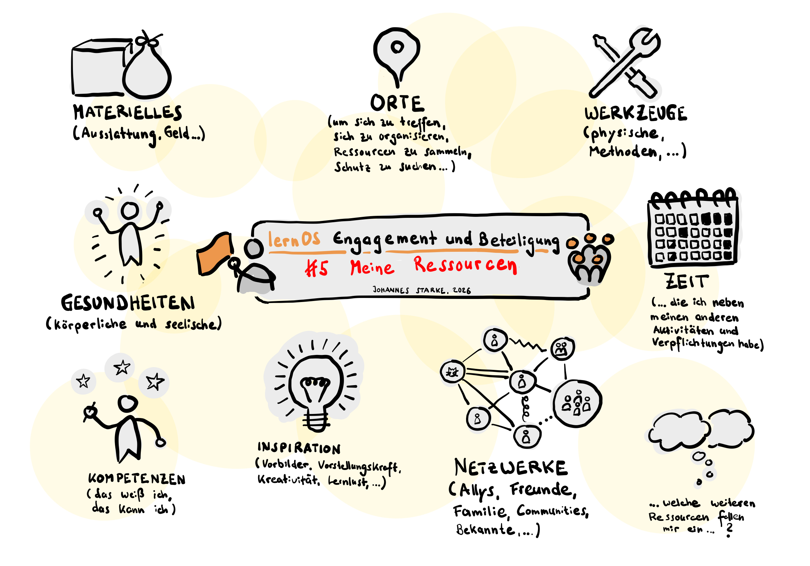

# Woche 5: Meine Ressourcen
Vielleicht fühlst Du Dich von den vielen Möglichkeiten, die sich für Dein persönliches Engagement bieten, und den vielen Beispielen und Vorbildern überwältigt. Vielleicht denkst Du: So viel Zeit habe ich nicht! Das wäre eine weitere Verpflichtung neben diesem, jenem, drittem .. und alles ist doch wichtig! Finde ich dafür die Kraft? Das übersteigt meine Fähigkeiten. Und woher nehme ich das Geld dafür? All das sind Fragen, die die Dir zur Verfügung stehenden Ressourcen betreffen. 

Denn Ressourcen sind eben nicht nur materiell, sondern können vielfältig sein, z. B.
- Materielles (Ausstattung und Geld)
- Orte (um sich zu treffen, sich zu organisieren oder um Ressourcen zu tanken …)
- Werkzeuge (physische, aber auch Methoden, Frameworks …)
- Verfügbare Zeit (neben Deinen vielen anderen Aktivitäten)
- Gesundheiten (physische und psychische)
- Kompetenzen (Was weißt Du, was kannst Du)
- Netzwerke (z. B. Allys, Freunde, Bekannte, Famile oder Fachnetzwerke, die Dich unterstützen)
- Inspiration (Vorbilder, Vorstellungskraft, Kreativität, Lernlust, …)
- … welche weiteren Ressourcen fallen Dir ein?

Engagement bedeutet, sich permanent nicht nur der eigenen Ressourcen bewusst zu sein, sondern auch schmerzlich deren Mangel zu spüren. Aktivist:innen haben ein hohes Risiko, einen Burn-out zu erleiden. Gleichzeitig kann das Gefühl, aktiv zu sein, das Gefühl von Selbstwirksamkeit geben. 

Es ist sehr wichtig, dass Du Dir darüber klar wirst, welche Ressourcen Du hast oder aufbauen kannst, und welche Dir auch nicht zur Verfügung stehen. Reflektiere darüber für Dich und auch mit Menschen, denen Du vertraust. Finde eine Art des Engagement, die zu Deinen Ressourcen passt. Wenn Du beispielsweise nicht die Zeit, die Kraft oder das Geld hast, jede Woche zu einer bestimmten Zeit an einem bestimmten Ort zu sein, ist vielleicht eine Art des Engagements besser für Dich, in dem Du flexibel und variabel darüber bestimmen kannst, wie Du Dich situativ einbringst. 
## Vorbereitung: 
Mach Dir Gedanken und Notizen zu folgenden Kategorien und erfasse sie in einer Tabelle:
- Diese Ressourcen habe ich reichlich
- Diese Ressourcen habe ich begrenzt
- Diese Ressourcen möchte ich durch mein Engagement aufbauen 
## Vertiefende Quellen (optional):
- Über die  Löffel-Theorie lässt sich erklären, dass Menschen nicht gleichermaßen viel gesundheitliche Energie in ihr Engagement einbringen können: [https://de.wikipedia.org/wiki/Löffel-Theorie](https://de.wikipedia.org/wiki/Löffel-Theorie) 
- In der „4-in-1-Perspektive“ beschreibt die Marxistin und Feministin Frigga Haug auf bestechend einfache und anschlussfähige Weise, wie ein Leben mit gerechter Verteilung der verfügbaren Zeit auf Carearbeit, Lohnarbeit, Kultur und Bildung und politische Einmischung aussehen könnte. Dieser Foliensatz liefert einen schnellen Überblick: [https://www.uni-bremen.de/fileadmin/user\_upload/sites/chancengleichheit/Angebote/carat\_-\_caring\_all\_together/Materialien\_\_\_Veranstaltungsmaterial\_\_Literatur/Die\_4-in-1-Perspektive\_carat\_Auszug.pdf](https://www.uni-bremen.de/fileadmin/user_upload/sites/chancengleichheit/Angebote/carat_-_caring_all_together/Materialien___Veranstaltungsmaterial__Literatur/Die_4-in-1-Perspektive_carat_Auszug.pdf) 
- Im Podcast tl;dr \#36: Frigga Haug: «Die Vier-in-einem-Perspektive» mit Katja Kipping  wird die 4-in-1-Perspektive ausführlich analysiert: [https://www.rosalux.de/mediathek/media/element/2497](https://www.rosalux.de/mediathek/media/element/2497)
- In diesem Artikel haben die beiden Autor:innen des LernOS-Guides Gabriele Schobess und Johannes Starke ihre Gedanken zu (Lern-)ressourcen aufgeschrieben: [https://johannes-starke.de/lernressourcen/](https://johannes-starke.de/lernressourcen/)
## Playlist zu Woche 5: 
Hör Dir diese Songs an, wenn Du möchtest. Findest Du einen Song, der Dich anspricht, Dir Energie gibt oder Dich auf anzapfbare Ressourcen von Dir aufmerksam macht? Oder kommt Dir ein anderes Lied in den Sinn? Teile Deine Wochen-Songs gerne in den Kommentaren oder unter dem Hashtag \#lernOSEngagement 
- Billy Bragg - There Is Power in a Union [https://youtu.be/VwP-5ac51Dw?si=VTZyqzBIFUVZ3nll](https://youtu.be/VwP-5ac51Dw?si=VTZyqzBIFUVZ3nll)
- Grossstadtgeflüster - Feierabend [https://youtu.be/ysgS4P4uHdo?si=ORkyFOYXw0B83EO8**](https://youtu.be/ysgS4P4uHdo?si=ORkyFOYXw0B83EO8)
- Neonschwarz - Atmen [https://youtu.be/yYcfnPt12l0?si=dnK0sSkUP2cDHMZQ](https://youtu.be/yYcfnPt12l0?si=dnK0sSkUP2cDHMZQ) 
- Lou Reed - Perfect Day [https://youtu.be/9wxI4KK9ZYo?si=BtK90dRkgKFPRThX](https://youtu.be/9wxI4KK9ZYo?si=BtK90dRkgKFPRThX)
- Feine Sahne Fischfilet - Zuhause [https://youtu.be/QmHTcxY0S8Y?si=gRIpW7yW7EYTFYWu](https://youtu.be/QmHTcxY0S8Y?si=gRIpW7yW7EYTFYWu)
- Bruneau und Mondmann - Hand in Hand [https://youtu.be/jPebO7yc4ko?si=9kCcSg7VNPshcw6S](https://youtu.be/jPebO7yc4ko?si=9kCcSg7VNPshcw6S)
- Hinterlandgang - Für alle [https://youtu.be/u6ZDkhpBIXQ?si=FtxJrcJYLo6lc6o6](https://youtu.be/u6ZDkhpBIXQ?si=FtxJrcJYLo6lc6o6)
- Gil Scott-Heron - The Revolution Will Not Be Televised  [https://youtu.be/vwSRqaZGsPw?si=p3GLvXMl1K7pXrob**](https://youtu.be/vwSRqaZGsPw?si=p3GLvXMl1K7pXrob)

## Im Weekly
### Check-In (ca. 10 Minuten, also 2 Minuten pro Mitglied)
- Was brauchst Du heute?
- Welcher Song aus der Playlist trägt Dich durch die Woche? Wie und wieso?
- Zu was hast Du Dich in der vergangenen Woche engagiert … und wirke es noch so klein?
- Welcher Gedanke ist Dir aus dem letzten Weekly präsent?
### Vorstellung (ca. 30  Minuten, also 6 Minuten pro Mitglied)
- Stellt euch gegenseitig die Ergebnisse eurer Vorbereitung vor: Welche deiner Ressourcen stehen dir reichlich zur Verfügung, welche sind begrenzt und welche möchtest du durch dein Engagement aufbauen?
- Vielleicht habt ihr euch im Check-In bereits über die euch jetzt und heute zur Verfügung stehenden Ressourcen ausgetauscht. Nutze die Gelegenheit und ergänze noch etwas, beispielsweise:
	- Welche deiner Ressourcen sind heute besonders rar oder reichlich?
	- Um welche Ressource bittest du deine Mitlernenden?
	- Welche Ressource kannst du heute verschenken, an wen und wie?
- Nehmt euch pro Vorstellung bewusst ein paar Minuten Zeit, um eure Eindrücke und Gedanken zu sammeln und euch gegenseitig zu fragen: „Was brauchst Du?“ Achtet an dieser Stelle darauf, von vermeintlich gutgemeinten Ratschlägen abzusehen, die manchmal mehr Druck aufbauen als hilfreich sind. Ressourcen (gerade gesundheitliche) sind oft etwas sehr persönliches und untrennbar mit der Lebensrealität ihrer Träger:innen verbunden.

Macht euch zu den Vorstellungen, Gedanken und Angeboten Notizen, um im nächsten Schritt auf sie zurückgreifen zu können.
### Ergänzung oder Konkretisierung eurer Ressourcen (ca. 15 Minuten, also 3 Minuten pro Mitglied):
- Was habt ihr aus von den Vorstellungen, Hinweisen und Geschenken eurer Mitzirkelnden gelernt? Nehmt euch jeweils eine Minute zum Nachdenken. Ergänzt, schärft oder konkretisiert eure Ressourcensammlung und teilt eure Überarbeitung miteinander.
### Check-Out** (ca. 5 Minuten, also 1 Minute pro Mitglied)
- Was nimmst Du mit – in einem Satz?
## Nachbereitung
Lass Deine eigene Ressourcen-Sammlung Revue passieren und überarbeite sie eventuell, indem Du das Feedback Deiner Mitzirkelnden Revue passieren lässt. Auf welche Ressourcen seid ihr im Gespräch gekommen, die Du einzubringen möchtest?

Schreibe einer oder mehreren Mitzirkelnden im Nachgang eine Nachricht, in der Du sie in ihrer Ressourcendarstellung bestärkst. Oft sind wir uns eigener Ressourcen nicht bewusst, bis wir durch Dritte auf sie hingewiesen werden.
