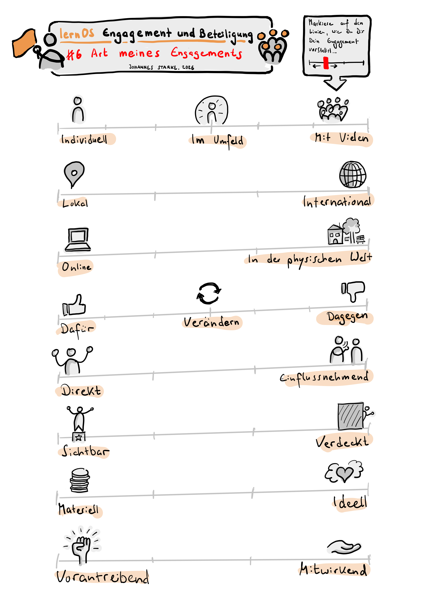

## 6 – Art meines Engagements konkretisieren

In dieser Woche wirst Du erneut einen Schritt konkreter. Nachdem Du in den letzten Wochen erarbeitet hast, welche Themen Dir wichtig sind, wofür Du Dich engagieren willst, welche konkreten Veränderungen Du anstrebst und welche Deiner Ressourcen Du einbringen kannst und möchtest, ist es jetzt an der Zeit, Dir Formen des Engagements zu suchen und Dich vielleicht sogar Organisationen, Initiativen oder Aktionsnetzwerken anzuschließen.

Vielleicht möchtest Du Dich zunächst eigeninitiativ einbringen. Vielleicht fallen Dir die ersten Schritte in einer Gruppe leichter. Die Bandbreite möglicher Formen Deines Engagements ist riesig. 

Du könntest mit bewussten kleinen Handlungen im Alltag starten (Formen der sozialen Kontaktaufnahme und Verbundenheit, solidarisches Verhalten gegenüber Menschen, die Du unterstützen magst, bewussten Kaufentscheidungen). Du könntest einen Beitrag in den sozialen Medien schreiben, eine Petition unterzeichnen, an einer Demo teilnehmen, ein Meetup besuchen, Geld spenden, eine Weiterbildung absolvieren, ein Ehrenamt suchen, in eine Partei eintreten, Gewerkschaftsmitglied werden … die Möglichkeiten sind vielfältig. Nimm Dir in dieser Woche vor, Dir ein paar Möglichkeiten herauszusuchen.

Achte bei Deiner Suche darauf, achtsam mit Deinen Ressourcen umzugehen. Es schadet Dir und vielleicht anderen, wenn Du Dich übernimmst und z. B. Arten des Engagements wählst, die einen zeitlich regelmäßigen Einsatz voraussetzen, den Du aber nicht längerfristig aufbringen kannst. Nimm Dir nicht vor, von Tag 1 an ein glänzendes Vorbild zu sein oder 100% konsequent in allem zu sein, was Du tust (wappne Dich gegen entsprechende Vorwürfe, die Dir vielleicht begegnen werden!). Du musst nicht Deinen Job wechseln oder nur noch Bio-Produkte kaufen, wenn das finanziell oder aus anderen Verpflichtungen gerade nicht geht! Setze Dich nicht  psychisch oder physisch belastenden Situationen aus, wenn sich das für Dich nicht sicher anfühlt.

Auch ist es völlig in Ordnung, gegen etwas zu sein. Verweigerung, Protest, Blockade oder Sabotage können legitime und sinnvolle Formen des Aktivismus sein. Du musst nicht „konstruktiv“ alternative Lösungsvorschläge für etwas anbieten, das an sich falsch ist oder außerhalb Deines direkten Einflussbereiches liegt. Solche Forderungen sind hegemoniale Taktiken, um Protest im Keim zu ersticken. Versuche, sie zu ignorieren. Dagegensein ist in Ordnung!

> **Persönliche Erfahrung von Gabriele:** Eine Nachbarin fragte mich, ob ich ihre Rolle als Sprecherin einer Nachhaltigkeits-Initiative übernehmen möchte. Bis zu diesem Zeitpunkt hat sich mein Ehrenamt auf punktuelle Initiativen in Schulen oder das Amt der Elternsprecherin beschränkt. Ehrlich gesagt habe ich bis zu diesem Zeitpunkt diese Aktivitäten gar nicht als Ehrenamt eingestuft. Ich bin auch nicht als Aktivistin im Nachhaltigkeitsbereich aktiv gewesen. Aber was soll ich sagen: Es ist perfekt für mich. Ich baue die (nicht vorhandenen) Kommunikationskanäle und Social Media auf, habe eine Webpräsenz erstellt, einen Podcast initiiert und bin derzeit dabei die solitär aktiven Einzelgruppierung zu vernetzen. Ich kann komplett „ausleben“ was mir sowieso Spaß macht. Ich unterstütze die Aktivist:innen dabei, ihre Arbeit sichtbar zu machen. Ganz nebenbei hat die Rolle Einfluß auf mein Wissen in diesem Bereich und Teile meines Lebens verändert. Die Rolle ist perfekt für mich. Meine Social Media Aktivität in dieser Rolle beschränkt sich auf das Schreiben von Posts für die Gruppe, obwohl ich auf Social Media ansonsten sehr aktiv bin. 

## Vorbereitung: 
Erstelle zunächst eine Liste möglicher Arten Deines Engagements. Vielleicht hilft es Dir, sie zu charakterisieren, z. B. folgendermaßen:

- Individuell / Mit meinem Umfeld / Mit vielen anderen Engagierten

- Lokal / International

- Online / In der physischen Welt

- Einmalig / Unregelmäßig / Regelmäßig / Dauerhaft

- Dafür / Verändern / Dagegen

- Direkt / Einflussnehmend

- Sichtbar / Verdeckt

- Materiell / Ideell

- Vorantreibend / Mitwirkend

… welche weiteren Charakteristiken Deines Engagements fallen Dir ein?

Gehe jetzt auf die Suche nach ganz konkreten Quellen, Gruppen, Aktiven etc. und liste sie auf. Wenn Du alleine starten möchtest, brauchst Du vielleicht Anleitungen, Bezugsquellen für Material oder Orte, um wirksam zu werden. Wenn Du gemeinsam mit anderen aktiv werden möchtest, suche nach für Dich passenden Anschlussmöglichkeiten.

Achte bei Deiner Suche darauf, auch Quellen anzuzapfen, die vielleicht nicht im Internet zu finden sind. Vielleicht finden sich hilfreiche Strukturen in Deiner direkten Nachbarschaft oder an Orten, an denen Du täglich verkehrst?

Quellen Deiner Recherche könnten z. B. sein:

- Soziale Netzwerke (wo engagieren sich Vorbilder von Dir?)

- Portale, Jobbörsen, Ehrenamtsportale, Weiterbildungsportale usw. im Internet

- Alle Orte, mit denen Du regelmäßig in Kontakt stehst (an Deinem Arbeitsplatz, in der Schule Deiner Kinder, …)

- Deine Nachbarschaft

- Lokalpresse oder Informationsportale der Lokalverwaltung

- Lokale Initiativen, Stadtteiltreffs, Gemeinde- oder Bürger:innen-Häuser

- Kneipen, Cafés und Kulturstädten, die schwarze Bretter aushängen haben

- Suche/Biete-Aushänge in Lebensmittelgeschäften

Am besten gehst Du selbst auf die Suche. Weitere Inspiration findest Du in den folgenden Quellen ...
### Vertiefende Quellen (optional):
- Auf <https://demokratie-navi.de> kannst Du einen interaktiven Test machen, der Dir Vorschläge macht, welche Art der demokratischen Mitgestaltung zu Dir passen könnte. 
- Viele Nachbarschaftsinitiativen und Vereine posten ihre Aktivitäten auf der kommerziellen Nachbarschafts-Plattform <https://nebenan.de>. Ein Blick kann nicht schaden. Sei Dir allerdings bewusst, dass die Plattform mit Deinen Daten Geld verdient. Manche Nutzer:innen berichten von problematischem Publikum.
- Barcamps (ein partizipatives Veranstaltungsformat, bei dem alle Beteiligten eigene Themen einbringen und besprechen können) sind eine gute Möglichkeit, Mitstreiter:innen kennenzulernen, Initiativen kennenzulernen und mehr über Themen oder lokale Aktivitäten zu erfahren. Es gibt regional und thematisch ausgerichtete Barcamps. Die größte Liste von Barcamps im deutschsprachigen Raum findest Du auf <https://www.barcamp-liste.de/>
- Wenn Du Nägel mit Köpfen machen und Deinen Job wechseln möchtest, ist vielleicht ein Blick auf die folgenden Jobbörsen interessant: <https://www.greenjobs.de>, <https://talents4good.org>, <https://goodjobs.eu> 
- Eines der größten und aktuellsten Veranstaltungsverzeichnisse zu demokratie-fördernden Aktionen findest Du auf <https://www.demokrateam.org/aktionen/>. Dein Ziel, wenn Du Dich diese Woche einer Demo anschließen möchtest!
- Politisches Engagement auf LinkedIn? Klingt zunächst seltsam, aber in der LinkedIn-Gruppe „Nie wieder ist jetzt“ findest Du vielleicht die eine oder andere Person, mit der Du Dich verbinden kannst: <https://www.linkedin.com/groups/12957371/> 
- Es gibt unendlich viele Ehrenamtsportale. Die Deutsche Stiftung für Engagement und Ehrenamt stellt die großen Engagement-Plattformen im Steckbrief vor: <https://www.deutsche-stiftung-engagement-und-ehrenamt.de/mitmachen/finde-dein-passendes-ehrenamt/> 
- Viele weitere, auch kleine Freiwilligenagenturen sind im Agenturatlas der bagfa (Bundesarbeitsgemeinschaft der Freiwilligenagenturen e.V.) gesammelt: <https://bagfa.de/agenturatlas/> 
- <https://www.betterplace.org/de> bezeichnet sich als Deutschlands größte Spendenplattform, auf der Du nicht nur selbst spenden, sondern auch Spendensammlungen starten kannst.
- Vielleicht möchtest Du Dein Engagement mit Vorlesen starten? Die Stiftung Lesen bringt Dich und Deine Zuhörerschaft zusammen: <https://www.stiftunglesen.de/mitmachen/freiwilliges-engagement-fuers-lesen> 
- WeChange ist nicht nur ein Anbieter digitaler Infrastruktur für soziale Projekte, sondern hat auf seiner Webseite auch eine Karte mit laut Eigenangabe „über 4.000 Gruppen und 11.000 Projekten“, auf der ihr nach Initiativen in eurer Nähe suchen könnt: <https://wechange.de/cms/> 
      
### Playliste/Song/Inspiration
Hör Dir diese Songs an, wenn Du möchtest. Vielleicht sind Titel darunter, die dir mehr über dein mögliches Engagement verraten, die dich auf Personen oder Gruppen neugierig machen oder dir zeigen, wo dein Platz sein könnte? Findest Du einen Song, der dich besonders anspricht oder den du bei deinem Engagement in Dauerschleife hören würdest? Oder kommt dir ein anderes Lied in den Sinn? Teile deine Wochen-Songs gerne in den Kommentaren oder unter dem Hashtag #lernosEngagement.

- [Bob Marley - Get Up Stand Up](https://youtu.be/RhJ0q7X3DLM?si=LaOMXlakHRPV2n_s)

- [Die Ärzte - Deine Schuld](https://youtu.be/kRrP-bZvD2s?si=FpCnwLDgQPlVGrbb)

- [DOTA & Sarah Lesch - Zeitgemäße Ansprache](https://youtu.be/GUzC84CmeXM?si=M3jVvhpc-zVMTRTJ)

- [Fridays for Future DE - Kein Grad Weiter](https://youtu.be/xmIb1HSDOq8?si=mvjFlptKnxj5MzAE) 

- [Sookee - D.R.A.G.](https://youtu.be/BZvF1_XyIKU?si=1iuuscAqa7dDEjLd)

- [Kabin Crew - The Spark](https://youtu.be/njE3EknkkBY?si=FHj6FqaRo42aQjXE)

- [Bikini Kill - Rebel Girl](https://youtu.be/8yhk7f0ydq4?si=2sSuh4Rbkoe2TwQg) 

- [Iriepathie feat. Irie Révoltés - Laut Sein](https://youtu.be/unyp3zi-W_E?si=DVGWJaCSaj2oYyJF)

- [Yung Pepp: Laut sein (immer)](https://www.youtube.com/watch?v=3zuso3nEgnQ)

- [Finna - Musik ist Politik](https://youtu.be/U85ZKIE7f4k?si=W1R0iraGh9DkK6Ew) 

- [Mine - Ich weiss es nicht](https://youtu.be/eKhbeDXVScA?si=ijLhivqpqdncNdzS) 

## Ablauf des wöchentlichen Treffens 6
### Check-In (ca. 10 Minuten, also 2 Minuten pro Mitglied)
- Was brauchst Du heute?
- Welcher Song aus der Playlist trägt Dich durch die Woche? Wie und wieso?
- Zu was hast Du Dich in der vergangenen Woche engagiert … und wirke es noch so klein?
- Welcher Gedanke ist Dir aus dem letzten Weekly präsent?
### Vorstellung eurer Vorbereitungen (ca. 30 Minuten, also 6 Minuten pro Mitglied)
- Stellt euch gegenseitig eure Listen vor und teilt Hinweise, Ergänzungen und Empfehlungen.
- Nehmt euch pro Vorstellung bewusst ein paar Minuten Zeit, ergänzende Quellen oder Empfehlungen aus dem eigenen Netzwerk zu finden und mit der vorstellenden Person zu teilen.
- Macht euch zu den Vorstellungen und Hinweisen Notizen, um im nächsten Schritt auf sie zurückgreifen zu können.
### Ergänzung oder Konkretisierung eurer Themen (ca. 15 Minuten, also 3 Minuten pro Mitglied):
- Was habt ihr aus von den Vorstellungen und Hinweisen eurer Mitzirkelnden gelernt? Nehmt euch jeweils eine Minute zum Nachdenken. Ergänzt, schärft oder konkretisiert eure Themensammlung und teilt eure Überarbeitung miteinander.
### Check-Out (ca. 5 Minuten, also 1 Minute pro Mitglied)
- Was nimmst Du mit – in einem Satz?

## Nachbereitung
Erhöhe und vertiefe Dein Wissen zu den Formen des Engagements, die Du Dir ausgewählt hast. Recherchiere tiefer und beziehe die Tipps Deiner Mitzirkelnden ein. Wenn Du Dich für Gruppen, Vereine o. ä. Interessiert, suche nach Ansprechpersonen. Vielleicht magst Du schon eine Nachricht schicken oder bei einer Veranstaltung vorbeigehen? Nimm Dir vor, mindestens einen nächsten Schritt zu tun … wie klein er auch sein mag – und erzähle Deinen Mitzirkelnden zwischendurch oder bei eurem nächsten Treffen davon.