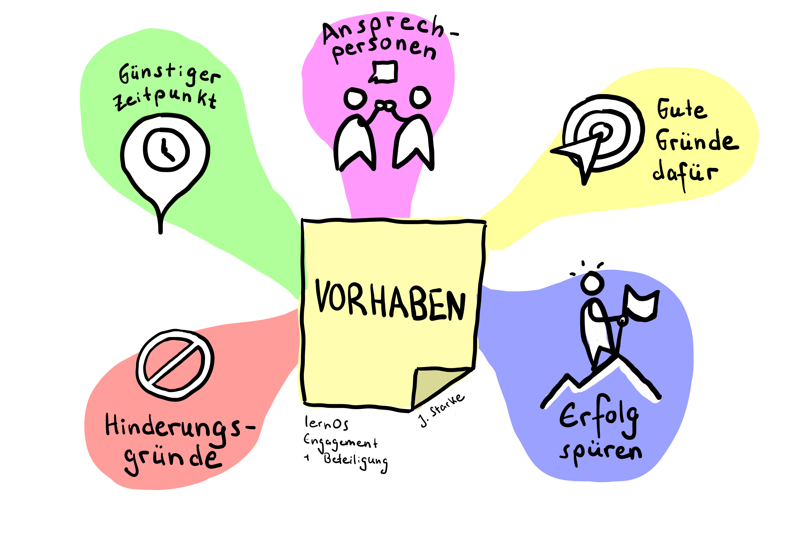

# Woche 7 – Maßnahmen, Aufgabe und Ziele ableiten

Was hast Du in der Nachbereitung der Ergebnisse von letzter Woche herausgefunden? Hast Du Dich schon intensiver damit beschäftigt, in welchem Kontext Du Dich engagieren möchtest? Hast Du schon erste Kontakte geknüpft, vielleicht sogar schon eine Rückmeldung erhalten, die Dir Ideen für Deine nächsten Schritte gibt?

Diese Woche soll Dich dazu anregen, den nächsten Schritt zu tun. Bitte entschuldige, wenn dieser Lernzirkel manchmal pushy wirkt. Vielleicht bist Du schon längst viel weiter und findest das Gedrängel und die Motivationssprüche albern. Vielleicht sind Deine Gedanken heute ganz woanders und Du hast diese Woche keinen Kopf, Pläne für die Zukunft zu machen. Beides ist okay. Vielleicht magst Du mit Deinen Mitzirkelnden darüber sprechen? Die meisten Lernzirkel-Gruppen gestalten die eine oder andere (oder auch alle …) Weekly-Beschreibungen nach ihren Bedarfen und Bedürfnissen um, weichen davon ab, nehmen sich für manche Übungen mehr Zeit und überspringen andere gänzlich. Wichtig ist nicht, genau die Übungen zu befolgen, sondern die Entwicklung und das Lernen von euch als Gruppe und von Dir.
## Vorbereitung: 
Du hast schon viel erreicht! Vielleicht magst Du innehalten und auf die vergangenen Kapitel zurückblicken? Du hast Dir in den letzten Wochen unter anderem über die folgenden Themen Gedanken gemacht, Ideen gesponnen und erste Initiativen gestartet:
- Grundsätzliche Erkenntnisse über und Austausch zu Deiner Motivation, mit diesem Lernzirkel zu starten und Dich zu engagieren (Woche 0)
- Themenfelder, zu denen Du Dich einbringen möchtest (Woche 1)
- Vorbilder und Initiativen in Deinem Themenfeld, historisch und aktuell. (Woche 2)
- Konkrete Beschreibung wünschenswerter Zukünfte zu Deinem Thema … die Du vielleicht sogar mit jemandem geteilt hast? (Woche 3)
- Eine Vorstellung davon, wie Du und Deine derzeitigen Aktivitäten bereits sichtbar sein und Wirkung entfalten können (Woche 4)
- Besseres Verständnis, welche Ressourcen Du hast und einbringen möchtest bzw. nicht hast oder einbringen kannst. Und eine Vorstellung, welche Ressourcen Du vielleicht im Rahmen Deines Engagements aufbauen könntest. (Woche 5)
- Eine  Liste interessanter Initiativen, Gruppen, Organisationen, Ansprechpersonen, Materialien und weiterer Quellen, die Dir helfen, in Deinem Engagement konkret zu werden (Woche 6)

Im Lauf Deines Rückblicks wirst Du wahrscheinlich bemerken, dass Du bereits viele Ideen hattest und Vorhaben formuliert hast. Einige bist Du vielleicht schon angegangen, andere hast Du verworfen, wieder andere einfach vergessen. Welche Deiner Ideen und Vorhaben entlang der bisherigen Wegstrecke sind es wert, wiederaufgenommen und ‚gerettet‘ zu werden – und welche dürfen zurückgelassen werden? 

Liste einige wiederaufzunehmenden Ideen auf und auch einige, die Du bewusst zurückgelassen hast. Du musst nicht alle Ideen systematisch abarbeiten. Vertiefe Dich in die, die Dir reizvoll scheinen. Überlege aber auch, wieso Dich andere Ideen nicht mehr interessieren. Überlege anschließend: Welche Vorhaben fehlen hier noch? Ergänze sie.

Erstelle im nächsten Schritt eine Tabelle mit …
- Vorhaben, die Du direkt umsetzen kannst, die Dich also nicht mehr als ca. 15 Minuten Konzentration und Zeit kosten
- Vorhaben, die Du innerhalb der nächsten zwei Wochen angehen kannst (falls zufällig gerade ein Urlaub oder eine andere sehr zeitintensive Aktivität ansteht, verlängere diese Frist nach Bedarf)
- Vorhaben, die mittel- oder langfristig sind (also erst in mehreren Wochen oder Monaten fertiggestellt werden können

Jetzt schnapp Dir mindestens eins, vielleicht sogar mehrere Deiner Vorhaben in Spalte 1 der Tabelle. **Wenn Du ein Vorhaben direkt umsetzen kannst … tu es jetzt!**

Wenn Du Dein erstes Vorhaben erledigt hast, sichte Deine weiteren Vorhaben. Mach Dir zu den einzelnen Vorhaben Notizen, z. B.
- Ein guter Zeitpunkt, um es anzugehen
- Menschen, die ich dazu ansprechen solltest
- Gründe, wieso ich dieses Vorhaben umsetzen möchtest
- Dinge, die mich derzeit noch hindern, dieses Vorhaben umzusetzen
- So werde ich spüren, dass ich das Vorhaben erfolgreich umgesetzt habe

Du bekommst hier ganz bewusst kein striktes Produktivitätsframework oder ähnliches präsentiert. In anderen LernOS-Leitfäden wird manchmal das Setzen „SMARTer“ Ziele empfohlen … wir verzichten ganz bewusst darauf, weil wir wissen, dass sich Lebensumstände, Zielsetzungen und Überzeugungen im persönlichen Engagement regelmäßig und manchmal radikal wandeln und Du Dich nicht selbst unter Druck setzen, sondern auf Deine Ressourcen achten solltest. Nur eins: Überlege Dir, wie Du Deine Liste leicht pflegbar machst und für Dich präsent hältst. Überarbeitest Du sie digital? Hängst Du sie Dir über Deinen Schreibtisch? Schreibst Du sie Dir in Deinen Kalender?

### Playlist zu Woche 7
Hör Dir diese Songs an, wenn Du möchtest. Findest Du einen Song, der Dich anspricht, einige Deiner Vorhabe und Ziele in Wort oder Ton fasst, oder den Du gerne beim Tun hören würdest? Oder kommt Dir ein anderes Lied in den Sinn? Teile Deine Wochen-Songs gerne in den Kommentaren oder unter dem Hashtag #lernOSEngagement
- Rio Riseup & KING KVNG – Im Westen nichts Neues <https://youtu.be/oHlCG8Rudf0?si=g57W_7ABX7H4xuHM>
- Bob Dylan - The Times They Are A-Changin'  <https://youtu.be/90WD_ats6eE?si=lcGZNntsL-bnWBBv>
- Madsen - Faust Hoch gegen Faschismus <https://youtu.be/EWiFJJv7hFg?si=jXlV2fm-fVpDxgFU> 
- The Busters feat. Katharina Wackernagel – Wehrt euch! <https://youtu.be/T6i58D2gN8Y?si=aF6qzasaRLQ89VbF> 
- Iriepathie feat. Irie Révoltés - Laut Sein <https://youtu.be/unyp3zi-W_E?si=DVGWJaCSaj2oYyJF> 
- Pink Floyd - Another Brick in the Wall, Part Two <https://youtu.be/HrxX9TBj2zY?si=oFCLiGZfu4MW_Y6j> 
- ok.danke.tschüss - Lützerath <https://youtu.be/atWbWs3QIWo?si=WSjepjpNUb-_INTE> 
- Paula Carolina - Angst Frisst Demokratie <https://youtu.be/kthuOmYYZLs?si=wtVcJzS7ffhRWGPc> 
- Bruneau - Ihr lasst uns keine Wahl <https://youtu.be/Enzp9hES9V8?si=yfo_bA9sngAXURGr>
- Bukahara - No! <https://youtu.be/b_XvmuRUlBU?si=PNLWiWQKrwLWsU7a> 
- Manic Street Preachers - If You Tolerate This Your Children Will Be Next <https://youtu.be/cX8szNPgrEs?si=cS7hvuX3SUKXZjF_> 
- Against Me! - Transgender Dysphoria Blues <https://youtu.be/eDJnhl_2d3k?si=3AJMTbUB8Olj8IHn> 

## Treffen Woche 7
### Check-In (ca. 10 Minuten, also 2 Minuten pro Mitglied)
- Was brauchst Du heute?
- Welcher Song aus der Playlist trägt Dich durch die Woche? Wie und wieso?
- Zu was hast Du Dich in der vergangenen Woche engagiert … und wirke es noch so klein?
- Welcher Gedanke ist Dir aus dem letzten Weekly präsent?
### Vorstellung eurer Vorbereitungen (ca. 30 Minuten, also 6 Minuten pro Mitglied)
- Stellt euch gegenseitig eure Vorhaben vor und teilt Hinweise, Ergänzungen und Empfehlungen.
- Stellt ebenfalls vor, wie ihr eure Vorhabenliste aktualisiert und für euch visualisiert. Ihr habt alle unterschiedliche Ansätze, um euch eure Vorhaben präsent zu halten.
- Nehmt euch pro Vorstellung bewusst ein paar Minuten Zeit, Unterstützung anzubieten, hilfreiche Quellen zu empfehlen oder bei der Schärfung der Vorhaben zu unterstützen. 
### Ergänzung oder Konkretisierung eurer Themen (ca. 15 Minuten, also 3 Minuten pro Mitglied):
- Was habt ihr aus von den Vorstellungen und Hinweisen eurer Mitzirkelnden gelernt? Nehmt euch jeweils eine Minute zum Nachdenken. Ergänzt, schärft oder konkretisiert eure Vorhaben und teilt eure Überarbeitung miteinander.
### Check-Out (ca. 5 Minuten, also 1 Minute pro Mitglied)
- Was nimmst Du mit – in einem Satz?

## Nachbereitung
Immer weiter machen …. ergänze Deine Liste und halte sie auf dem aktuellen Stand. Gehe weitere Vorhaben auf Deiner Liste an. Beobachte, welche Umstände dazu führen, dass Dir die Umsetzung leichter fällt. Beobachte auch, wann es Dir zu viel wird. Passe Deine Vorhaben daraufhin an: Wenn Du z. B. merkst, dass Dir die direkte Kontaktaufnahme mit Personen schwer fällt oder Du zeitlich nicht dazu kommst, überlege Dir Alternativen. Es ist keine nicht schlimm, Vorhaben wieder von der Liste zu streichen oder durch weniger ambitionierte zu ersetzen. 