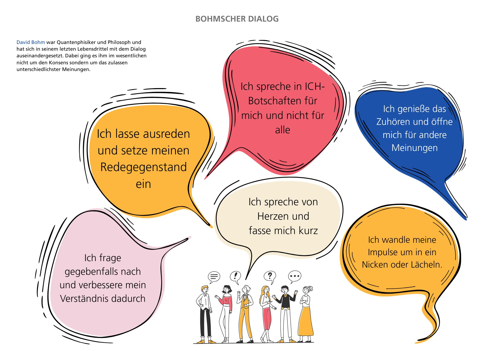

# 8 – Es ist soweit. Ins Tun gekommen? 

Es ist gar nicht so einfach aktiv zu werden. Oft wird ein Vorhaben von außen angestoßen, ohne das du konkret darauf gewartet hast aktiv zu werden. So ging es auch Gabriele. Sie wird es weiter unten erzählen. Beim letzten Treffen habt ihr eure ersten konkreten Schritte geplant. Euer Vorhaben, dass was ihr tun werdet. 

Es ist euer vorletztes Treffen. Wenn ihr heute mit dem Check-Out abschließt, werdet ihr euch wieder in 100 Tagen treffen. Das ist heute euer letztes Todo. Einen Termin in 100 Tagen auszumachen. 

Heute feiern wir. Wir feiern euch, die Ersteller:innen des Lernpfades. Ihr feiert euch. 8 Wochen habt ihr euch getroffen und wir hoffen ihr habt Klarheit gefunden, was euer Vorhaben betrifft, was eure Wirksamkeit betrifft und welche Schritte ihr konkret angehen wollt, oder auch nicht. Wir freuen uns mit euch.  

## Vorbereitung:
Wir schicken euch angelehnt an den „Bohmschen Dialog“ in einen Dialog. Begebt euch nochmal auf die Reise eurer 8 Wochen. Dabei sind für den Dialog die folgenden Rahmenbedingungen vorgegeben, lest euch diese vor dem nächsten Treffen durch:  

- Ich spreche von Herzen und fasse mich kurz.

- Ich spreche in ICH-Botschaften für mich und nicht für alle.

- Ich lasse ausreden und setze meinen Redegegenstand ein.

- Ich genieße das Zuhören und öffne mich für andere Meinungen.

- Ich frage gegebenfalls nach und verbessere mein Verständnis dadurch.

- Ich wandle meine Impulse um in ein Nicken oder Lächeln.

Im Bohmschen Dialog bringt ihr eure Ideen, Einsichten und Erkenntnisse vor. Die anderen ergänzen und hören sich uneingeschränkt und wertfrei zu, was ist neu an dem Gesagten, was überrascht euch? Der Dialog bringt euer Gesamtpotential der Gruppe nochmal zum Strahlen. 

> **Erfahrungsbericht Gabriele:** Das Thema Ehrenamt war bei mir lange kein Thema, bzw. war ich bereits im Ehrenamt habe es aber als solches nicht erkannt. Beispiel: Als Teil des Orga-Teams für die lernOS Convention wäre ich im Leben nicht darauf gekommen, dass es sich um Ehrenamt handelt. Ist es aber. Zu meinem aktuellen Ehrenamt bin ich auch eher durch Zufall gekommen: eine Nachbarin fragte mich ob ich ihre Sprecher:innen Rolle bei der Lokalen Agenda übernehmen möchte. Ob sie geahnt hat, dass es voll mein Ding ist? Jedenfalls kann ich dort all dass tun, was ich sowieso auch beruflich mache. Ich befinde mich mitten drin, die Lokale Agenda zu transformieren und neu auszurichten. Vernetze die Akteure, baue die Kommunikation neu auf und organisiere und beantrage Fördermittel, um die bisherige Arbeit weiterzuführen und für die Zukunft gut aufzustellen. Die Aktivitäten in Bezug auf die Projektgruppen, überlasse ich diesen. Ich kümmere mich um die Rahmenbedingungen. Wenn eine Gruppe Unterstützung braucht springe ich ein und helfe dabei Aktionen zu bewerben oder mit anderen Aktiven zu verbinden. 

## Treffen Woche 8
### Check-In (Zeitmanagement: Alle zusammen bekommen kurz 1 Minute zum nachdenken in Stille, dann 1-3 Minuten pro Person) 
Eure Check-In Frage heute lautet: Was hast du zuletzt gefeiert? 
### Aufgabe 
Heute zum Abschluss taucht ihr ein in den „Bohmschen Dialog“. Damit könnt ihr eure Lernreise nochmals reflektieren und gemeinsam auf das gelernte aufbauen und nochmals reinspüren. Geht nacheinander die Fragen durch nach den Vorgaben und Ideen des „Bohmschen Dialog“. 

Vereinbart wie ihr den Redestab weitergebt oder macht eine Reihenfolge fest: z.B. indem ihr nacheinander im Uhrzeiger-Richtung sprecht. Dann schließt die Redende Person einfach ab mit „ich gebe weiter“. 

Wir haben folgende Fragen für euch vorbereitet: 

1. Was hast du in den letzten 8 Wochen über dich gelernt? 
2. Was hast du von deinen Mitreisenden gelernt? 
3. Wie werden wir uns in 100 Tagen wiedersehen? Was wird sich verändert haben?

Schließt ab, wann ihr fertig seid, mit einer letzten Fragerunde: wie erging es euch mit diesem Dialog-Format. Habt Spaß und seid ein bißchen wehmütig. Freut euch darauf, euch in 100 Tagen wiederzusehen. 

Vereinbart einen Termin in 100 Tagen. 
### Playliste/Song/Inspiration 
100 Tage werden oft im Kontext Staffelstabübergabe in Organisationen oder Regierungen gesetzt. 100 Tage sind die Tage, in denen eine Richtung vorgegeben wird und die ersten Maßnahmen ergriffen werden. Heute beginnen eure 100 Tage, die mit eurem erneuten Wiedersehen verbunden sind. Eben genau dann. In 100 Tagen. 
Jetzt bitte den Playbutton drücken: 
<https://youtu.be/8ouI5KcyHfE?si=noS4n2snQCCoBtCK>

### Weitere Quellen
- <https://de.wikipedia.org/wiki/100-Tage-Frist>
- Bohmscher Dialog: <https://lernende-organisationen.ch/dialog/>
- <https://www.mehr-demokratie.de/fileadmin/img/2024/Mehr_Wissen/Mehr_Demokratie_-_Leitfaden_fuer_Sprechen_und_Zuhoeren.pdf>

